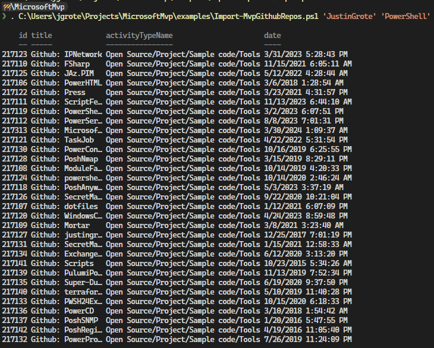
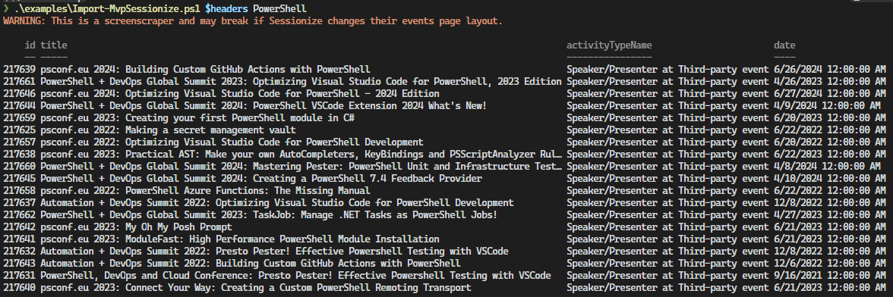

# Microsoft MVP Activities PowerShell Module

This module uses the new 2023+ MVP API to programatically submit MVP activities. It enables you to create new MVP activities using IntelliSense.

This API is undocumented, use at your own risk.

Inspired by https://github.com/lmammino/mvp-activities

PowerShell Gallery: https://www.powershellgallery.com/packages/MicrosoftMvp

## Demos

### Logging In
By running `Connect-Mvp`, you will be presented with an OAuth login flow to connect to your mvp account.

### Create a New Activity (with InteliSense)

https://github.com/JustinGrote/MicrosoftMvp/assets/15258962/ad7d6925-e8d8-4d6e-8d24-2e7b3575c77d

### Copy an Existing Activity

https://github.com/JustinGrote/MicrosoftMvp/assets/15258962/c981f734-eddc-40ad-b756-aac0461a4cf2

## Example Scripts

### Import-MvpGithubRepos

### Import-MvpSessionize

To use this script you must copy the response headers from an authenticated Sessionize session in devtools. I recommend using `Get-Clipboard -Raw`.

